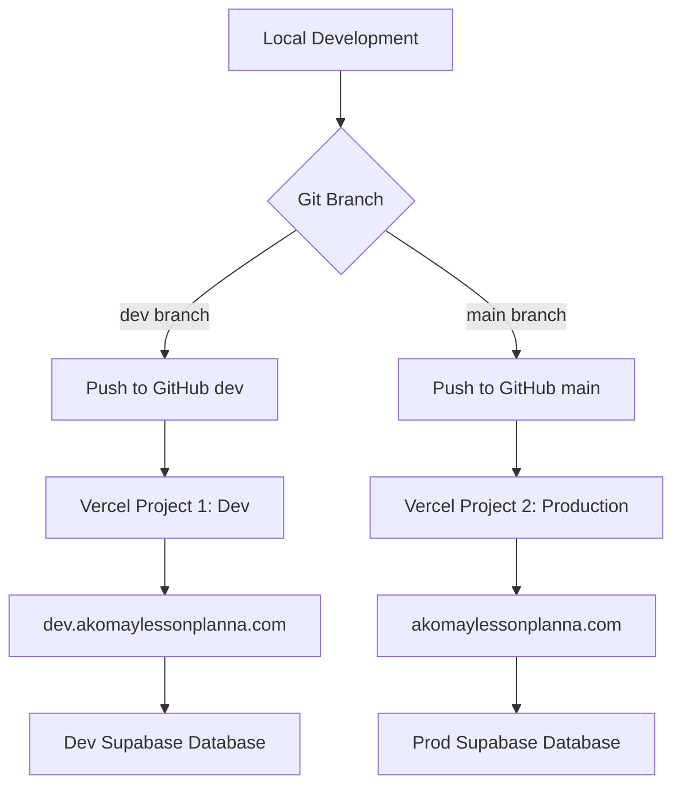

# Dev/Prod Isolated Environment Setup

## Overview

Set up a complete isolated dev/prod workflow with:

- Two separate Vercel projects (dev and production)
- Branch-based workflow (dev branch and main branch)
- Subdomain for development (dev.akomaylessonplanna.com)
- Two Supabase projects (already created)
- Clear separation of environments

## Architecture



## Implementation Steps

### 1. Create Implementation Plan Folder

**File:** Create `docs/implementationplan/` folder if it doesn't exist

### 2. Create Dev Branch Locally

**Commands to document:**

```bash
git checkout -b dev
git push -u origin dev
```

### 3. Set Up Two Vercel Projects

**Vercel Project 1: Development**

- Name: `akomaylessonplanna-dev`
- Connected branch: `dev`
- Domain: `dev.akomaylessonplanna.com`
- Environment variables: Dev Supabase credentials

**Vercel Project 2: Production**

- Name: `akomaylessonplanna`
- Connected branch: `main`
- Domain: `akomaylessonplanna.com`
- Environment variables: Prod Supabase credentials

### 4. Configure Hostinger DNS

Add CNAME record for dev subdomain:

```
Type: CNAME
Name: dev
Value: cname.vercel-dns.com
TTL: 3600
```

### 5. Environment Variables Configuration

**Dev Project Variables:**

```
NEXT_PUBLIC_SUPABASE_URL = dev-project-url
NEXT_PUBLIC_SUPABASE_ANON_KEY = dev-anon-key
SUPABASE_SERVICE_ROLE_KEY = dev-service-role-key
NEXT_PUBLIC_APP_URL = https://dev.akomaylessonplanna.com
RESEND_API_KEY = [same]
RESEND_FROM_EMAIL = noreply@akomaylessonplanna.com
FACEBOOK_APP_SECRET = [same]
CRON_SECRET = [same]
```

**Production Project Variables:**

```
NEXT_PUBLIC_SUPABASE_URL = https://iokinyttkzmcnmznxgza.supabase.co
NEXT_PUBLIC_SUPABASE_ANON_KEY = prod-anon-key
SUPABASE_SERVICE_ROLE_KEY = prod-service-role-key
NEXT_PUBLIC_APP_URL = https://akomaylessonplanna.com
RESEND_API_KEY = [same]
RESEND_FROM_EMAIL = noreply@akomaylessonplanna.com
FACEBOOK_APP_SECRET = [same]
CRON_SECRET = [same]
```

### 6. Update OAuth Redirect URIs

Add dev subdomain to:

- Google Cloud Console OAuth settings
- Facebook Developer Console OAuth settings
- Supabase Auth redirect URLs

New redirect URIs to add:

- `https://dev.akomaylessonplanna.com/auth/callback`

### 7. Database Migration Workflow

**Development Process:**

```bash
# 1. Create migration in dev
npx supabase migration new feature_name

# 2. Apply to dev database
npx supabase db push --db-url "dev-connection-string"

# 3. Test on dev.akomaylessonplanna.com

# 4. When ready, apply to production
npx supabase db push --db-url "prod-connection-string"

# 5. Merge dev to main
git checkout main
git merge dev
git push origin main
```

### 8. Daily Workflow

**New Feature Development:**

```bash
# Switch to dev branch
git checkout dev

# Make changes, test locally

# Push to dev branch
git add .
git commit -m "Add feature"
git push origin dev
# → Deploys to dev.akomaylessonplanna.com

# Test on dev subdomain
# When ready for production:
git checkout main
git merge dev
git push origin main
# → Deploys to akomaylessonplanna.com
```

## Documentation Updates

### File 1: CONFIGURATION-SETUP.md

**Current location:** `docs/CONFIGURATION-SETUP.md`

**New location:** `docs/implementationplan/CONFIGURATION-SETUP.md`

**Updates needed:**

1. Add section: "Step 0: Create Dev Branch"
2. Update Vercel setup section to show TWO project imports
3. Add Hostinger DNS section for dev subdomain (CNAME record)
4. Update OAuth sections to include dev subdomain redirects
5. Add new section: "Vercel Project Configuration" showing branch settings
6. Add verification checklist for both environments

**Key additions:**

- Dev branch creation instructions
- Two Vercel project setup (step-by-step for each)
- Branch deployment settings in Vercel
- Dev subdomain DNS configuration
- Testing URLs: dev.akomaylessonplanna.com vs akomaylessonplanna.com

### File 2: ENVIRONMENT-VARIABLES.md

**Current location:** `docs/ENVIRONMENT-VARIABLES.md`

**New location:** `docs/implementationplan/ENVIRONMENT-VARIABLES.md`

**Updates needed:**

1. Update diagram to show 3 environments: Local, Dev Vercel, Prod Vercel
2. Add section: "Three Environment Setup"
3. Create comparison table: Local vs Dev vs Prod
4. Add "Switching Between Environments" section
5. Document which variables differ per environment
6. Add troubleshooting for wrong environment connections

**Key additions:**

- Three-way environment comparison
- Local .env.local for dev work
- Dev Vercel project variables
- Prod Vercel project variables
- How to verify which environment you're connected to

### File 3: DEPLOYMENT-WORKFLOW.md

**Current location:** `docs/DEPLOYMENT-WORKFLOW.md`

**New location:** `docs/implementationplan/DEPLOYMENT-WORKFLOW.md`

**Updates needed:**

1. Replace simple workflow with branch-based workflow
2. Add "Branch Strategy" section
3. Update main diagram to show dev and main branches
4. Add "Development Workflow" section (dev branch)
5. Add "Production Deployment" section (main branch)
6. Add "Database Migration Workflow" section
7. Add "Rollback Strategy" for both environments
8. Update all examples to use branch-based workflow

**Key additions:**

- Git branch commands (checkout, merge)
- When to use dev branch vs main branch
- How to test on dev subdomain before production
- Safe migration process (dev → prod)
- Hotfix workflow (emergency production fixes)

## Additional File to Create

### File 4: DEV-PROD-SETUP-GUIDE.md

**Location:** `docs/implementationplan/DEV-PROD-SETUP-GUIDE.md`

**Purpose:** Master guide specifically for setting up the isolated dev/prod environment

**Contents:**

1. Overview of isolated approach vs simple approach
2. Prerequisites (2 Supabase projects, GitHub repo)
3. Step-by-step Vercel project setup
4. DNS configuration walkthrough
5. Environment variable checklist
6. Testing and verification steps
7. Troubleshooting common issues
8. Quick reference for daily workflow

## Migration Strategy for Existing Setup

If already deployed to production:

1. Current production becomes "Production Project"
2. Import repo again for "Dev Project"
3. Configure dev branch deployment
4. No downtime for existing production
5. Gradual migration of workflow

## Benefits of This Setup

- Complete isolation: dev changes never affect production
- Safe testing: break things on dev without consequences
- Database safety: production data never touched during development
- Team collaboration: share dev.akomaylessonplanna.com for review
- Flexible: can have different feature flags, configs per environment

## Files Summary

**To Move and Update:**

1. `docs/CONFIGURATION-SETUP.md` → `docs/implementationplan/CONFIGURATION-SETUP.md`
2. `docs/ENVIRONMENT-VARIABLES.md` → `docs/implementationplan/ENVIRONMENT-VARIABLES.md`
3. `docs/DEPLOYMENT-WORKFLOW.md` → `docs/implementationplan/DEPLOYMENT-WORKFLOW.md`

**To Create:**

4. `docs/implementationplan/DEV-PROD-SETUP-GUIDE.md` (new master guide)

**Original files** will be deleted from `docs/` folder after moving to `implementationplan/`