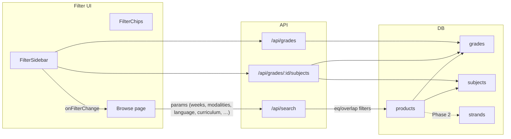

# Lesson-Plan JSON to Product Schema and Feature 08 Filters

## 1. Field-by-field mapping

### 1.1 JSON config vs current state

| JSON / Doc                                                           | Products DB ([005_feature_03_products.sql](supabase/migrations/005_feature_03_products.sql)) | Search API ([app/api/search/route.ts](app/api/search/route.ts)) | Filter UI ([components/products/filter-sidebar.tsx](components/products/filter-sidebar.tsx)) | Product form ([app/shop/products/new/page.tsx](app/shop/products/new/page.tsx)) |
| -------------------------------------------------------------------- | -------------------------------------------------------------------------------------------- | --------------------------------------------------------------- | -------------------------------------------------------------------------------------------- | ------------------------------------------------------------------------------- |
| **document_types** (DLL, DLP)                                        | `specific_type` VARCHAR(50)                                                                  | `specific_type` supported                                       | No filter; sidebar has Product Type only                                                     | `specific_type` when product_type=lesson_plans (dll/dlp)                        |
| **curriculums** (MATATAG, K to 12)                                   | Missing                                                                                      | Missing                                                         | Missing                                                                                      | Missing                                                                         |
| **quarters** (Quarter 1–4)                                           | `quarter` 1–4                                                                                | `quarter` supported                                             | Quarter select                                                                               | Quarter select                                                                  |
| **weeks** 1–9, multiselect                                           | `weeks` INTEGER[]; comment says 1–8                                                          | **Not supported** (param never read)                            | WEEKS 1–8; array not serialized correctly to search                                          | WEEKS 1–8                                                                       |
| **modalities** (Face-to-face, Online, Modular, Blended), multiselect | Missing                                                                                      | Missing                                                         | Missing                                                                                      | Missing                                                                         |
| **teaching_frameworks** (4As, 5Es, etc.)                             | Missing                                                                                      | Missing                                                         | Missing                                                                                      | Missing                                                                         |
| **languages** (12 options, no default)                               | `language` VARCHAR(20) DEFAULT 'english' (english, filipino, bilingual)                      | `language` supported                                            | **Not in sidebar**                                                                           | **Not in form** (API defaults to 'english')                                     |
| **Regular/SPED hierarchy**                                           | Single `grade_id`/`subject_id`; no class type                                                | Single grade/subject                                            | Grade from `/api/grades`; Subject from `/api/grades/[id]/subjects`                           | Same; no SPED path                                                              |
| **SHS strands** (Grade 11/12)                                        | No strand                                                                                    | Missing                                                         | Missing                                                                                      | Missing                                                                         |
| **SPED Graded / Non-Graded**                                         | Missing                                                                                      | Missing                                                         | Missing                                                                                      | Missing                                                                         |

### 1.2 Broken or inconsistent behavior

- **Weeks**
  - Sidebar uses `WEEKS = [1..8]` and multiselect; browse builds `params.set('weeks', String([1,2,3]))` → `weeks=1,2,3`. Search ignores `weeks`. Products table stores `weeks INTEGER[]` but filter does nothing.
  - JSON requires weeks **1–9** and multiselect.
- **Language**
  - DB and search support it; sidebar and product form do not. Form never sends it, so everything stays default `'english'`. JSON requires 12 options and **no default** (user must choose).
- **Array params in browse**
  - `Object.entries(filters).forEach(([k,v]) => params.set(k, String(v)))` turns arrays into comma-separated strings. Search expects single values for most params and does not parse `weeks` at all.

---

## 2. Database changes

### 2.1 New migration (add columns, no drop)

**File:** New migration after existing ones (e.g. `021_lesson_plan_filters.sql`).

- **products**
  - `curriculum` VARCHAR(50) NULL — `'MATATAG Curriculum' | 'K to 12 Curriculum'`.
  - `modalities` TEXT[] NULL — one or more of `Face-to-face`, `Online`, `Modular`, `Blended`.
  - `teaching_framework` VARCHAR(50) NULL — `4As`, `5Es`, etc., or NULL.
  - `class_type` VARCHAR(20) NULL — `'regular' | 'sped'` for hierarchy branching.
  - `learner_path` VARCHAR(30) NULL — for SPED: `'graded' | 'non_graded'`.
  - `strand_id` UUID NULL, FK to new `strands(id)` — only for Grade 11/12 when class_type=regular.
- **language**
  - Option A (minimal): keep `language` VARCHAR(20), expand allowed values via CHECK or app validation to the 12 JSON options; **remove DEFAULT** so “no default” is enforced in app.
  - Option B (clean): add `languages` reference table and `product_language` or store code (e.g. `english`, `filipino`, `cebuano_bisaya`, …) and validate against JSON list in app. Migration can add CHECK with allowed values.
- **weeks**
  - Add CHECK on `weeks`: only 1–9, e.g. `CHECK (weeks IS NULL OR (array_length(weeks,1) IS NOT NULL AND NOT EXISTS (SELECT 1 FROM unnest(weeks) w WHERE w NOT BETWEEN 1 AND 9)))`. Adjust if you allow empty array.

### 2.2 New reference data (separate migration or same)

- **strands**  
  - `id`, `name`, `code` (e.g. STEM, ABM, GAS, TVL-ICT, …), `is_active`, `sort_order`. Seed from JSON `shs_details.strands`.
- **grades**
  - No schema change. Seed/update:
    - Ensure K–12 exist.
    - Optionally add “SPED” or use `class_type` + existing grades for “Graded (Inclusive)”; Non-Graded uses **levels** (Primary, Intermediate, Pre-Vocational, Transition) — either as special grade-like rows or a separate `sped_levels` table and `sped_level_id` on products. Recommend **Phase 2** for SPED levels.
- **subjects**
  - Keep `grade_subjects`. Add **strand_subjects** (strand_id, subject_id) for SHS specialized subjects. Sync subject names/codes from JSON hierarchy (MATATAG vs K–12 per grade) in seed/migrations.
- **Curricula / modality / language options**
  - Either hardcode in app from JSON or add small lookup tables (e.g. `curriculums`, `modalities`, `instruction_languages`) and reference them from products. For speed, Phase 1 can use ENUMs or CHECK and keep options in config.

### 2.3 Scope of phases

- **Phase 1 (DB):** Add `curriculum`, `modalities`, `teaching_framework`, `class_type`, `learner_path`, `strand_id`; extend `language` (and remove default in app); add weeks 1–9 CHECK; create `strands` and seed.
- **Phase 2 (DB):** SPED levels/subjects, MATATAG vs K–12 subject sets per grade, strand–subject mapping.

---

## 3. API changes

### 3.1 Search API ([app/api/search/route.ts](app/api/search/route.ts))

- **Query params**
  - Parse `weeks`: e.g. `weeks=1,2,3` or `weeks[]=1&weeks[]=2` → filter products where `products.weeks && ARRAY[1,2,3]::integer[]` (overlap).
  - Add `modalities`: if `modalities=A,B` then `products.modalities && ARRAY['A','B']`.
  - Add `curriculum`, `document_type` (alias for `specific_type` when type=lesson_plans), `class_type`, `strand_id`.
  - Keep `language`; ensure value set matches allowed list (from JSON or DB).
- **Cache key**
  - Include new params in [generateSearchCacheKey](app/api/search/route.ts) (and any `getFilterCounts` usage) so cache respects new filters.

### 3.2 Browse → Search wiring

- **Array serialization**
  - When building `queryParams` from `filters`, serialize arrays explicitly: e.g. `weeks=[1,2,3]` → `weeks=1,2,3` (comma-separated) and document that search expects `weeks=1,2,3`. Or send `weeks=1&weeks=2&weeks=3` and parse `searchParams.getAll('weeks')` in the route. Prefer one convention (e.g. comma) and use it in both browse and search.

### 3.3 Grades and subjects

- **Existing**
  - [app/api/grades/route.ts](app/api/grades/route.ts): returns grades.
  - [app/api/grades/[gradeId]/subjects/route.ts](app/api/grades/[gradeId]/subjects/route.ts): returns subjects for that grade via `grade_subjects`.
- **Phase 2**
  - Optional: `GET /api/lesson-plan-config` (or similar) returning the full JSON or a flattened structure for UI (grades, subjects by grade, strands, curricula, modalities, languages, weeks 1–9). Filter UI and product form can drive options from this.
  - For SHS: when `grade` is 11 or 12, require `strand_id` before showing “specialized” subject list; subjects can come from `strand_subjects` + core.

---

## 4. UI changes

### 4.1 Filter sidebar ([components/products/filter-sidebar.tsx](components/products/filter-sidebar.tsx))

- **Weeks**
  - Use 1–9 (replace `WEEKS = [1..8]`). Keep multiselect. Ensure selected `weeks` are sent as one param (e.g. `weeks=1,2,3`) when calling `onFilterChange` and in URL.
- **Language**
  - Add “Language of instruction” multiselect or single select using the 12 options from JSON. No default: require explicit choice for lesson-plan products if you want strict “no default” only there; or apply “no default” globally by not pre-filling.
- **Modality**
  - Add “Modality” multiselect (Face-to-face, Online, Modular, Blended). Map to `modalities` in filters and search params.
- **Document type (lesson plans)**
  - When Product Type = “Lesson Plans”, show “Document type” with DLL / DLP; map to `specific_type` (or `document_type` in URL and map to `specific_type` in search).
- **Curriculum**
  - Add “Curriculum” (MATATAG / K to 12). Map to `curriculum`.
- **Class type / SPED (Phase 2)**
  - Add “Class type” or “Learner type”: Regular / SPED. If SPED, show “Graded (Inclusive)” vs “Non-Graded (Transition)” and adjust Grade/Subject lists (e.g. levels and SPED subjects).
- **Subject**
  - Today: single select. JSON says “Subject multiselect”. Add multiselect for subject; search must support `subject_id` as multiple (e.g. `subject_id=id1&subject_id=id2` or `subject_id=id1,id2` and filter `subject_id IN (...)`).

### 4.2 Browse page ([app/marketplace/browse/page.tsx](app/marketplace/browse/page.tsx))

- When building `URLSearchParams` from `filters`, support array values: e.g. if `filters.weeks` is `[1,2,3]`, set `params.set('weeks', filters.weeks.join(','))`; do the same for `modalities`, `subject_id` if multiselect. On init from `searchParams`, parse `weeks` and arrays back from URL (e.g. `searchParams.get('weeks')?.split(',').filter(Boolean)`).
- Pass through new filter keys: `curriculum`, `modalities`, `document_type`/`specific_type`, `language`, and later `class_type`, `strand_id`.

### 4.3 Filter chips ([components/search/filter-chips.tsx](components/search/filter-chips.tsx))

- Add chips for: **Weeks** (e.g. “Weeks: 1, 2, 3”), **Language**, **Modality** (e.g. “Modality: F2F, Modular”), **Curriculum**, **Document type** (when applicable). Handle “remove” for each so it updates the same structure (single vs array) that browse and search use.

### 4.4 Product form ([app/shop/products/new/page.tsx](app/shop/products/new/page.tsx), edit equivalent)

- **Language**
  - Add “Language of instruction” dropdown/multiselect using the 12 options; no pre-selection (or only placeholder “Select language”). Send `language` in submit body; API already supports `body.language`.
- **Weeks**
  - Change to 1–9; keep multiselect. Validate “at least one week” and “each in 1–9”.
- **Curriculum**
  - When product type is Lesson Plans (and optionally others), add “Curriculum” (MATATAG / K to 12).
- **Modality**
  - Add “Modality” multiselect; store in `modalities` (array) in DB.
- **Teaching framework**
  - Optional field “Teaching framework” (4As, 5Es, Inquiry-Based, Direct Instruction, Custom) for lesson plans; map to `teaching_framework`.
- **Class type / Strand / SPED (Phase 2)**
  - Add “Class type” (Regular / SPED). If Regular and grade 11/12, require “Strand” and load subjects from strand + core. If SPED, choose Graded vs Non-Graded and show levels/subjects per JSON.

---

## 5. Implementation order (phased)

### Phase 1 – Align with JSON and fix gaps (no new hierarchy)

1. **DB migration**
  - Add columns: `curriculum`, `modalities`, `teaching_framework`, `class_type`, `learner_path`, `strand_id` (nullable, FK to `strands` after creating it).
  - Create `strands` table and seed from JSON.
  - Add CHECK on `weeks` for 1–9.
  - Do not remove `language` default in DB yet; enforce “no default” in UI only (product form + filter sidebar both require explicit choice when used).
2. **Search API**
  - Parse `weeks` (e.g. comma-separated), filter with `products.weeks && $arr`.
  - Add filters: `modalities` (overlap), `curriculum`, `document_type`/`specific_type`, keep `language`. Update cache key.
3. **Browse**
  - Serialize/parse `weeks` (and later `modalities`, `subject_id[]`) in URL and when calling search.
4. **Filter sidebar**
  - Weeks 1–9; Language (12 options, no default); Modality (multiselect); Document type when type=Lesson Plans; Curriculum. Optional: Teaching framework.
5. **Filter chips**
  - Chips for weeks, language, modality, curriculum, document type.
6. **Product form**
  - Language (required for lesson plans or overall, your choice), weeks 1–9, curriculum, modality, teaching_framework. Ensure POST/put sends the new fields.

### Phase 2 – Hierarchy (Regular/SPED, SHS, MATATAG)

1. **DB**
  - SPED: add `sped_levels` (or use grades) and `sped_level_id`; add SPED subjects and mapping. Populate subjects per grade from JSON (MATATAG vs K–12), and strand–subject mapping for SHS.
2. **APIs**
  - Grades/subjects (or new config API) return structure by `class_type` and, for SHS, by `strand_id`. Subject list for Grade 11/12 depends on strand.
3. **UI**
  - Class type → Regular vs SPED. For Regular + G11/12: strand required, then subject from strand. For SPED: Graded vs Non-Graded, levels, SPED subjects. Filter sidebar and product form both consume the same hierarchy.

---

## 6. Key files to touch

- **DB:** New migration(s) under [supabase/migrations/](supabase/migrations/) (e.g. `021_lesson_plan_filters.sql`, `022_strands_and_sped.sql`).
- **Search:** [app/api/search/route.ts](app/api/search/route.ts) (params, filters, cache key).
- **Browse:** [app/marketplace/browse/page.tsx](app/marketplace/browse/page.tsx) (params ⇄ filters for arrays).
- **Filters:** [components/products/filter-sidebar.tsx](components/products/filter-sidebar.tsx), [components/search/filter-chips.tsx](components/search/filter-chips.tsx).
- **Product form:** [app/shop/products/new/page.tsx](app/shop/products/new/page.tsx), [app/shop/products/[id]/edit/page.tsx](app/shop/products/[id]/edit/page.tsx).
- **Products API:** [app/api/products/route.ts](app/api/products/route.ts), [app/api/products/[id]/route.ts](app/api/products/[id]/route.ts) (accept and persist `curriculum`, `modalities`, `teaching_framework`, `class_type`, `learner_path`, `strand_id`).
- **Config:** Add a shared source for the lesson-plan JSON (e.g. `config/lesson-plan-hierarchy.json` or under `docs/`) and optionally a small API or static import so filter UI and form use the same options (quarters, weeks 1–9, modalities, languages, curricula, document types, teaching frameworks).

---

## 7. Optional diagram (data flow)

This plan maps the JSON to the schema and filters, lists required DB/API/UI edits, and splits work into Phase 1 (gaps and options) and Phase 2 (hierarchy: Regular/SPED, SHS strands, MATATAG).