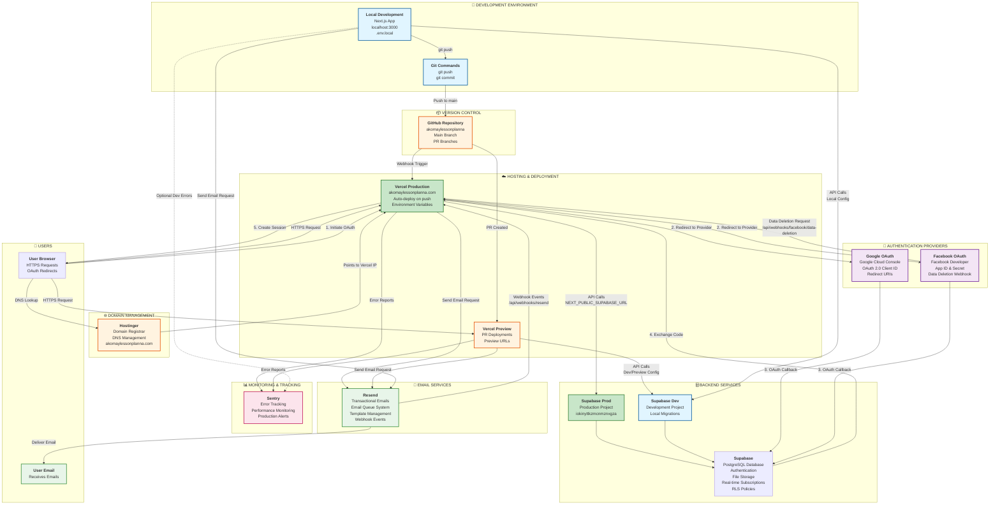

# AKOMAYLESSONPLANNA - System Architecture Diagram

This document provides a comprehensive visual overview of the application architecture, showing all services, environments, and data flows.

## Complete System Architecture



## Architecture Components

### 1. Development Environment
- **Local Development**: Next.js app running on `localhost:3000`
- **Environment Variables**: Stored in `.env.local` (not committed to Git)
- **Development Database**: Separate Supabase project for testing

### 2. Version Control (GitHub)
- **Repository**: `akomaylessonplanna`
- **Main Branch**: Auto-deploys to Vercel Production
- **PR Branches**: Auto-deploy to Vercel Preview environments

### 3. Hosting (Vercel)
- **Production**: `akomaylessonplanna.com` (custom domain)
- **Preview**: Automatic deployments for pull requests
- **Environment Variables**: Configured per environment (Production/Preview/Development)
- **Auto-Deploy**: Triggered on every push to main branch

### 4. Domain Management (Hostinger)
- **DNS Configuration**: Points domain to Vercel servers
- **Options**: 
  - Use Vercel nameservers (recommended)
  - Or add DNS A/CNAME records in Hostinger

### 5. Backend Services (Supabase)
- **PostgreSQL Database**: All application data
- **Authentication**: User auth with OAuth support
- **File Storage**: Product images, user avatars, documents
- **Real-time**: Subscriptions for live updates
- **RLS Policies**: Row-level security for data access

### 6. Authentication Providers

#### Google OAuth
- **Configuration**: Google Cloud Console
- **Flow**: User → Google → Supabase → App
- **Redirect URIs**: 
  - `https://[supabase-ref].supabase.co/auth/v1/callback`
  - `http://localhost:3000/auth/callback` (dev)
  - `https://akomaylessonplanna.com/auth/callback` (prod)

#### Facebook OAuth
- **Configuration**: Facebook Developer Console
- **Flow**: User → Facebook → Supabase → App
- **Webhook**: Data deletion callback at `/api/webhooks/facebook/data-deletion`
- **Redirect URIs**: Same as Google OAuth

### 7. Email Service (Resend)
- **Purpose**: Transactional emails (order confirmations, notifications, etc.)
- **Queue System**: Priority-based email queue with retry logic
- **Templates**: React Email templates with variable substitution
- **Webhooks**: Email events (delivered, opened, clicked, bounced)
- **Endpoint**: `/api/webhooks/resend`

### 8. Error Tracking (Sentry)
- **Purpose**: Production error monitoring and performance tracking
- **Integration**: Next.js SDK
- **Environment**: Configured via `NEXT_PUBLIC_SENTRY_DSN`
- **Note**: Currently planned, not fully implemented

## Data Flow Examples

### User Authentication Flow (OAuth)
1. User clicks "Sign in with Google/Facebook"
2. App redirects to OAuth provider (Google/Facebook)
3. User authorizes on provider's site
4. Provider redirects to Supabase callback URL
5. Supabase exchanges code for session
6. Supabase redirects to app callback (`/auth/callback`)
7. App creates user profile if needed
8. User is logged in and redirected to marketplace

### Email Sending Flow
1. Application event triggers email (e.g., order placed)
2. Email added to queue in Supabase database
3. Cron job processes queue (`/api/cron/process-email-queue`)
4. Email sent via Resend API
5. Resend delivers email to user
6. Resend webhook updates delivery status in database

### Deployment Flow
1. Developer makes changes locally
2. Commits and pushes to GitHub
3. GitHub webhook triggers Vercel
4. Vercel builds Next.js application
5. Vercel deploys to production (or preview for PRs)
6. Application connects to Supabase using environment variables
7. Domain (via Hostinger DNS) routes traffic to Vercel

## Environment Variables

### Development (Local)
```env
NEXT_PUBLIC_SUPABASE_URL=https://[dev-project].supabase.co
NEXT_PUBLIC_SUPABASE_ANON_KEY=[dev-anon-key]
SUPABASE_SERVICE_ROLE_KEY=[dev-service-role-key]
NEXT_PUBLIC_APP_URL=http://localhost:3000
RESEND_API_KEY=[resend-key]
RESEND_FROM_EMAIL=noreply@akomaylessonplanna.com
```

### Production (Vercel)
```env
NEXT_PUBLIC_SUPABASE_URL=https://iokinyttkzmcnmznxgza.supabase.co
NEXT_PUBLIC_SUPABASE_ANON_KEY=[prod-anon-key]
SUPABASE_SERVICE_ROLE_KEY=[prod-service-role-key]
NEXT_PUBLIC_APP_URL=https://akomaylessonplanna.com
RESEND_API_KEY=[resend-key]
RESEND_FROM_EMAIL=noreply@akomaylessonplanna.com
CRON_SECRET=[random-secret]
NEXT_PUBLIC_SENTRY_DSN=[sentry-dsn]
FACEBOOK_APP_SECRET=[facebook-secret]
```

## Key Integration Points

### Supabase Integration
- **Client-side**: `@supabase/ssr` for browser client
- **Server-side**: `@supabase/ssr` for server components and API routes
- **Auth Helpers**: Automatic session management

### OAuth Configuration
- **Supabase Dashboard**: Provider credentials stored securely
- **Redirect URLs**: Must match in both Supabase and OAuth provider settings
- **Callback Handler**: `/app/auth/callback/route.ts` processes OAuth responses

### Resend Integration
- **Client**: Singleton pattern in `lib/emails/resend-client.ts`
- **Queue System**: Database-backed queue with processor
- **Webhooks**: Secure webhook endpoint for email events

### Vercel Integration
- **Git Integration**: Automatic deployments from GitHub
- **Environment Variables**: Per-environment configuration
- **Cron Jobs**: Scheduled tasks for email queue processing
- **Custom Domain**: Automatic SSL certificate management

## Security Considerations

1. **Environment Variables**: Never commit secrets to Git
2. **OAuth Secrets**: Stored in Supabase Dashboard, not in code
3. **Service Role Key**: Server-side only, never exposed to client
4. **Webhook Security**: Signature verification for Resend and Facebook webhooks
5. **RLS Policies**: Database-level security for all data access
6. **HTTPS**: Enforced in production via Vercel SSL

## Monitoring & Observability

- **Vercel Analytics**: Built-in performance metrics
- **Supabase Dashboard**: Database metrics and logs
- **Sentry**: Error tracking and performance monitoring (planned)
- **Resend Dashboard**: Email delivery metrics
- **Application Logs**: Vercel function logs for debugging

---

**Last Updated**: January 2025
**Maintained By**: Development Team
