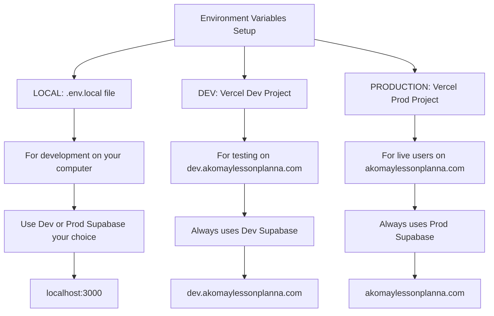

# Environment Variables Configuration Guide

This guide explains all environment variables needed for **three environments**: Local, Dev, and Production. Learn where to get each value and how they differ between environments.

## Three Environment Setup

With isolated dev/prod workflow, you now manage variables across three environments:



## Environment Comparison Table

| Variable | Local (.env.local) | Dev (Vercel Dev) | Prod (Vercel Prod) |
|----------|-------------------|------------------|-------------------|
| **NEXT_PUBLIC_APP_URL** | `http://localhost:3000` | `https://dev.akomaylessonplanna.com` | `https://akomaylessonplanna.com` |
| **NEXT_PUBLIC_SUPABASE_URL** | Dev or Prod (your choice) | Dev Supabase URL | Prod Supabase URL |
| **NEXT_PUBLIC_SUPABASE_ANON_KEY** | Dev or Prod (your choice) | Dev Supabase anon key | Prod Supabase anon key |
| **SUPABASE_SERVICE_ROLE_KEY** | Dev or Prod (your choice) | Dev Supabase service key | Prod Supabase service key |
| **RESEND_API_KEY** | Same for all | Same for all | Same for all |
| **RESEND_FROM_EMAIL** | Same for all | Same for all | Same for all |
| **FACEBOOK_APP_SECRET** | Optional | Required | Required |
| **CRON_SECRET** | Optional | Recommended | Required |
| **NEXT_PUBLIC_SENTRY_DSN** | Optional (skip) | Optional | Recommended |

## Variable-by-Variable Guide

### 1. NEXT_PUBLIC_SUPABASE_URL

**What it is**: The URL to your Supabase project

**Where to get it**:
- Go to https://supabase.com/dashboard
- Select your project (dev or prod)
- Settings → API
- Copy "Project URL"

**Local Development** (.env.local):
```env
# Option 1: Use dev database for local testing
NEXT_PUBLIC_SUPABASE_URL=https://[your-dev-project].supabase.co

# Option 2: Use prod database (be careful!)
NEXT_PUBLIC_SUPABASE_URL=https://iokinyttkzmcnmznxgza.supabase.co
```
**Recommendation**: Use dev database locally to avoid accidentally modifying production data.

**Dev Environment** (Vercel Dev Project):
```env
NEXT_PUBLIC_SUPABASE_URL=https://[your-dev-project].supabase.co
```
**MUST** be dev Supabase project.

**Production** (Vercel Prod Project):
```env
NEXT_PUBLIC_SUPABASE_URL=https://iokinyttkzmcnmznxgza.supabase.co
```
**MUST** be prod Supabase project.

---

### 2. NEXT_PUBLIC_SUPABASE_ANON_KEY

**What it is**: Public key for client-side Supabase access (safe to expose)

**Where to get it**:
- Same place as URL above
- Copy "anon public" key

**Local Development**:
```env
# Must match the Supabase URL you chose
NEXT_PUBLIC_SUPABASE_ANON_KEY=eyJhbGciOiJIUzI1NiIsInR5cCI6IkpXVCJ9...
```

**Dev Environment**:
```env
# From dev Supabase project
NEXT_PUBLIC_SUPABASE_ANON_KEY=eyJhbGciOiJIUzI1NiIsInR5cCI6IkpXVCJ9...
```

**Production**:
```env
# From prod Supabase project
NEXT_PUBLIC_SUPABASE_ANON_KEY=eyJhbGciOiJIUzI1NiIsInR5cCI6IkpXVCJ9...
```

**CRITICAL**: The anon key must match the URL. Don't mix dev URL with prod key!

---

### 3. SUPABASE_SERVICE_ROLE_KEY

**What it is**: Secret key for server-side database access (NEVER expose!)

**Where to get it**:
- Same place as above
- Click "Reveal" on "service_role" key
- Copy it

**Local Development**:
```env
# Must match the Supabase URL/anon key you chose
SUPABASE_SERVICE_ROLE_KEY=eyJhbGciOiJIUzI1NiIsInR5cCI6IkpXVCJ9...
```

**Dev Environment**:
```env
# From dev Supabase project
SUPABASE_SERVICE_ROLE_KEY=eyJhbGciOiJIUzI1NiIsInR5cCI6IkpXVCJ9...
```

**Production**:
```env
# From prod Supabase project
SUPABASE_SERVICE_ROLE_KEY=eyJhbGciOiJIUzI1NiIsInR5cCI6IkpXVCJ9...
```

**CRITICAL**: 
- Never commit this to Git
- Never expose to client-side code
- This bypasses all RLS policies!
- Must match the project (dev key with dev URL, prod key with prod URL)

---

### 4. NEXT_PUBLIC_APP_URL

**What it is**: The base URL of your application

**THIS IS THE KEY DIFFERENCE BETWEEN ENVIRONMENTS!**

**Local Development**:
```env
NEXT_PUBLIC_APP_URL=http://localhost:3000
```
No HTTPS, includes port number.

**Dev Environment**:
```env
NEXT_PUBLIC_APP_URL=https://dev.akomaylessonplanna.com
```
HTTPS, dev subdomain.

**Production**:
```env
NEXT_PUBLIC_APP_URL=https://akomaylessonplanna.com
```
HTTPS, main domain.

**Used for**:
- OAuth redirects
- Email links (password reset, verification)
- Absolute URL generation
- API callbacks

**Getting this wrong** will cause OAuth and email links to break!

---

### 5. RESEND_API_KEY

**What it is**: API key for sending emails via Resend

**Where to get it**:
- Go to https://resend.com
- Log in
- API Keys → Create API Key
- Copy the key (only shown once!)

**All Environments** (same key):
```env
RESEND_API_KEY=re_123456789abcdefghijklmnop
```

**Note**: You can use the same Resend key for all environments, or create separate keys if you want to track dev vs prod email usage separately.

---

### 6. RESEND_FROM_EMAIL

**What it is**: The "from" email address for sent emails

**All Environments** (same value):
```env
RESEND_FROM_EMAIL=noreply@akomaylessonplanna.com
```

**Note**: If you verify the domain in Resend, all three environments can use the same from address. For testing, Resend allows a limited number of emails without domain verification.

---

### 7. FACEBOOK_APP_SECRET

**What it is**: Secret key for Facebook data deletion webhook verification

**Where to get it**:
- Go to https://developers.facebook.com
- Your App → Settings → Basic
- Copy "App Secret"

**Local Development**:
```env
# Optional for local testing
FACEBOOK_APP_SECRET=abc123def456ghi789jkl
```

**Dev Environment**:
```env
# Required if testing Facebook OAuth
FACEBOOK_APP_SECRET=abc123def456ghi789jkl
```

**Production**:
```env
# REQUIRED for production
FACEBOOK_APP_SECRET=abc123def456ghi789jkl
```

**Note**: Usually the same secret for all environments (same Facebook app).

---

### 8. CRON_SECRET (Optional)

**What it is**: Secret for protecting cron job endpoints from unauthorized access

**How to generate**:
```bash
# In terminal:
node -e "console.log(require('crypto').randomBytes(32).toString('hex'))"
```

**Local Development**:
```env
# Optional
CRON_SECRET=your_random_secret_here
```

**Dev Environment**:
```env
# Recommended
CRON_SECRET=your_random_secret_here
```

**Production**:
```env
# REQUIRED for security
CRON_SECRET=your_random_secret_here
```

**Note**: You can use the same secret for all environments, or generate different ones for each.

---

### 9. NEXT_PUBLIC_SENTRY_DSN (Optional)

**What it is**: Data Source Name for Sentry error tracking

**Where to get it**:
- Go to https://sentry.io
- Your Project → Settings → Client Keys (DSN)
- Copy DSN

**Local Development**:
```env
# Usually skip this - you don't want local dev errors in Sentry
# NEXT_PUBLIC_SENTRY_DSN=https://abc123@o123456.ingest.sentry.io/123456
```

**Dev Environment**:
```env
# Optional - useful for catching dev environment errors
NEXT_PUBLIC_SENTRY_DSN=https://abc123@o123456.ingest.sentry.io/123456
```

**Production**:
```env
# HIGHLY RECOMMENDED for tracking production errors
NEXT_PUBLIC_SENTRY_DSN=https://abc123@o123456.ingest.sentry.io/123456
```

**Note**: You can create separate Sentry projects for dev and prod to track errors separately, or use the same DSN for both.

---

## Complete Configuration Examples

### Local Development (.env.local)

Create this file in your project root: `c:\Users\odvip\OneDrive\Desktop\JC\akomaylessonplanna\.env.local`

**Recommended setup (using dev database):**

```env
# Supabase - Dev Project (Recommended for local)
NEXT_PUBLIC_SUPABASE_URL=https://[your-dev-ref].supabase.co
NEXT_PUBLIC_SUPABASE_ANON_KEY=eyJhbGciOiJIUzI1NiIsInR5cCI6IkpXVCJ9.example_dev_anon_key
SUPABASE_SERVICE_ROLE_KEY=eyJhbGciOiJIUzI1NiIsInR5cCI6IkpXVCJ9.example_dev_service_key

# App URL (Required - always localhost for local)
NEXT_PUBLIC_APP_URL=http://localhost:3000

# Email Service (Required)
RESEND_API_KEY=re_YourResendApiKey
RESEND_FROM_EMAIL=noreply@akomaylessonplanna.com

# Facebook (Optional for local)
FACEBOOK_APP_SECRET=your_facebook_app_secret

# Cron (Optional for local)
CRON_SECRET=your_random_cron_secret

# Sentry (Skip for local)
# NEXT_PUBLIC_SENTRY_DSN=https://xxx@sentry.io/xxx
```

**Alternative setup (using prod database - be careful!):**

```env
# Supabase - Prod Project (Use with caution!)
NEXT_PUBLIC_SUPABASE_URL=https://iokinyttkzmcnmznxgza.supabase.co
NEXT_PUBLIC_SUPABASE_ANON_KEY=eyJhbGciOiJIUzI1NiIsInR5cCI6IkpXVCJ9.example_prod_anon_key
SUPABASE_SERVICE_ROLE_KEY=eyJhbGciOiJIUzI1NiIsInR5cCI6IkpXVCJ9.example_prod_service_key

# ... rest same as above
```

---

### Dev Environment (Vercel Dev Project)

Go to: Vercel Dashboard → `akomaylessonplanna-dev` → Settings → Environment Variables

Add these **one by one** with Environment set to "Production":

```
Name: NEXT_PUBLIC_SUPABASE_URL
Value: https://[your-dev-ref].supabase.co
Environment: Production

Name: NEXT_PUBLIC_SUPABASE_ANON_KEY
Value: [Your DEV Supabase anon key]
Environment: Production

Name: SUPABASE_SERVICE_ROLE_KEY
Value: [Your DEV Supabase service role key]
Environment: Production

Name: NEXT_PUBLIC_APP_URL
Value: https://dev.akomaylessonplanna.com
Environment: Production

Name: RESEND_API_KEY
Value: [Your Resend API key]
Environment: Production

Name: RESEND_FROM_EMAIL
Value: noreply@akomaylessonplanna.com
Environment: Production

Name: FACEBOOK_APP_SECRET
Value: [Your Facebook app secret]
Environment: Production

Name: CRON_SECRET
Value: [Your generated secret]
Environment: Production

Name: NEXT_PUBLIC_SENTRY_DSN
Value: [Your Sentry DSN] (Optional)
Environment: Production
```

**CRITICAL**: All Supabase credentials must be from **DEV** Supabase project!

---

### Production Environment (Vercel Prod Project)

Go to: Vercel Dashboard → `akomaylessonplanna-prod` → Settings → Environment Variables

Add these **one by one** with Environment set to "Production":

```
Name: NEXT_PUBLIC_SUPABASE_URL
Value: https://iokinyttkzmcnmznxgza.supabase.co
Environment: Production

Name: NEXT_PUBLIC_SUPABASE_ANON_KEY
Value: [Your PROD Supabase anon key]
Environment: Production

Name: SUPABASE_SERVICE_ROLE_KEY
Value: [Your PROD Supabase service role key]
Environment: Production

Name: NEXT_PUBLIC_APP_URL
Value: https://akomaylessonplanna.com
Environment: Production

Name: RESEND_API_KEY
Value: [Your Resend API key]
Environment: Production

Name: RESEND_FROM_EMAIL
Value: noreply@akomaylessonplanna.com
Environment: Production

Name: FACEBOOK_APP_SECRET
Value: [Your Facebook app secret]
Environment: Production

Name: CRON_SECRET
Value: [Your generated secret]
Environment: Production

Name: NEXT_PUBLIC_SENTRY_DSN
Value: [Your Sentry DSN]
Environment: Production
```

**CRITICAL**: All Supabase credentials must be from **PROD** Supabase project!

---

## Key Differences Summary

### What Changes Between Environments

**ALWAYS DIFFERENT:**
- ✅ `NEXT_PUBLIC_APP_URL` - URL changes for each environment
- ✅ `NEXT_PUBLIC_SUPABASE_URL` - Dev vs Prod database URL
- ✅ `NEXT_PUBLIC_SUPABASE_ANON_KEY` - Must match database
- ✅ `SUPABASE_SERVICE_ROLE_KEY` - Must match database

**USUALLY THE SAME:**
- 🟡 `RESEND_API_KEY` - Can use same key or separate
- 🟡 `RESEND_FROM_EMAIL` - Usually same for all
- 🟡 `FACEBOOK_APP_SECRET` - Same Facebook app for all
- 🟡 `CRON_SECRET` - Can be same or different
- 🟡 `NEXT_PUBLIC_SENTRY_DSN` - Can be same or separate projects

### Critical Matching Rules

**Rule 1**: Supabase credentials must match within each environment
- ✅ Dev URL + Dev Anon Key + Dev Service Key
- ✅ Prod URL + Prod Anon Key + Prod Service Key
- ❌ Dev URL + Prod Anon Key (WILL NOT WORK!)

**Rule 2**: APP_URL must match actual domain
- ✅ Local: `localhost:3000`
- ✅ Dev: `dev.akomaylessonplanna.com`
- ✅ Prod: `akomaylessonplanna.com`
- ❌ Wrong URL will break OAuth and email links!

---

## Switching Between Environments

### How to Switch Local Development Between Dev and Prod Databases

**Use Dev Database Locally** (Recommended):
```env
# In .env.local
NEXT_PUBLIC_SUPABASE_URL=https://[dev-ref].supabase.co
NEXT_PUBLIC_SUPABASE_ANON_KEY=[dev-anon-key]
SUPABASE_SERVICE_ROLE_KEY=[dev-service-key]
```

**Use Prod Database Locally** (Caution!):
```env
# In .env.local
NEXT_PUBLIC_SUPABASE_URL=https://iokinyttkzmcnmznxgza.supabase.co
NEXT_PUBLIC_SUPABASE_ANON_KEY=[prod-anon-key]
SUPABASE_SERVICE_ROLE_KEY=[prod-service-key]
```

**After changing** `.env.local`:
1. Stop dev server (Ctrl+C)
2. Run `npm run dev` again
3. Hard refresh browser (Ctrl+Shift+R)

### How to Verify Which Environment You're Connected To

**Check in browser console:**
```javascript
// Open browser console (F12)
console.log(process.env.NEXT_PUBLIC_SUPABASE_URL)
console.log(process.env.NEXT_PUBLIC_APP_URL)
```

**Check in your code** (temporary debugging):
```typescript
// Add to any page temporarily
console.log('Environment:', {
  url: process.env.NEXT_PUBLIC_APP_URL,
  supabaseUrl: process.env.NEXT_PUBLIC_SUPABASE_URL,
})
```

**Create test data to verify:**
- Add a test product or user
- Check which Supabase project it appears in
- Dev project? → Connected to dev
- Prod project? → Connected to prod

---

## How to Set Environment Variables

### Local Development

1. **Create `.env.local` file** in project root
   ```
   c:\Users\odvip\OneDrive\Desktop\JC\akomaylessonplanna\.env.local
   ```

2. **Add variables** in format: `KEY=value`
   - No quotes needed (usually)
   - One variable per line
   - No spaces around `=`

3. **NEVER commit this file to Git**
   - Already in `.gitignore`
   - Contains secrets!

4. **Restart dev server after changes**
   - Stop: Ctrl+C
   - Start: `npm run dev`
   - Hard refresh browser: Ctrl+Shift+R

### Vercel (Dev and Prod)

1. **Go to Vercel Dashboard**
   - https://vercel.com/dashboard

2. **Select project**
   - `akomaylessonplanna-dev` for dev
   - `akomaylessonplanna-prod` for production

3. **Add variables**
   - Settings → Environment Variables
   - Click "Add New"
   - Enter Name and Value
   - Select Environment: "Production"
   - Click "Save"

4. **Redeploy for changes to take effect**
   - Go to Deployments
   - Click ⋯ on latest deployment
   - Click "Redeploy"
   - Wait 2-5 minutes

---

## Security Best Practices

### DO ✓

- ✓ Use `.env.local` for local secrets
- ✓ Add `.env.local` to `.gitignore`
- ✓ Use dev database for local development (safer!)
- ✓ Use different Supabase projects for dev and prod
- ✓ Store production secrets in Vercel only
- ✓ Rotate keys immediately if exposed
- ✓ Use strong, unique passwords for each Supabase project

### DON'T ✗

- ✗ Never commit `.env.local` to Git
- ✗ Never share `SUPABASE_SERVICE_ROLE_KEY` publicly
- ✗ Never put secrets in client-side code
- ✗ Never hardcode secrets in your code
- ✗ Never post secrets in public forums/screenshots
- ✗ Never use prod database for local testing (risk data corruption!)
- ✗ Never mix dev and prod credentials (dev URL + prod key)

---

## Variable Name Prefixes

### `NEXT_PUBLIC_*`

**Exposed to browser** - visible in client-side code

✅ **Safe for**:
- Public API URLs
- Public keys (Supabase anon key)
- App URL
- Sentry DSN

❌ **Never use for**:
- Private API keys
- Service role keys
- Secrets

**Used in**: React components, client-side JavaScript

### No prefix

**Server-side only** - never exposed to browser

✅ **Use for**:
- Service role keys
- API secrets
- Admin passwords
- Private tokens

**Used in**: API routes, server components, server actions

---

## Troubleshooting

### "Missing environment variables" error

**Solution**:
- Check variable names match exactly (case-sensitive)
- Restart dev server: Ctrl+C → `npm run dev`
- Verify `.env.local` is in project root (not in subdirectory)
- Check for typos in variable names

### Variables not working in Vercel

**Solution**:
- Verify variables in correct project (dev vs prod)
- Check Environment is set to "Production"
- Redeploy after adding variables
- Clear cache: Hard refresh (Ctrl+Shift+R)

### OAuth redirects failing

**Solution**:
- Check `NEXT_PUBLIC_APP_URL` matches actual URL
- Verify no trailing slash: `https://example.com` ✅ / `https://example.com/` ❌
- Confirm redirect URIs in OAuth provider match
- Verify Supabase redirect URLs include the domain

### Supabase connection errors

**Solution**:
- Verify project URL is correct
- Ensure keys are from same project (dev with dev, prod with prod)
- Check Supabase project is active (not paused)
- Verify RLS policies allow access

### Wrong database connected

**Symptoms**:
- Test data appearing in production
- Production data appearing in dev
- Can't find expected data

**Solution**:
1. Check environment variables in Vercel
   - Dev project should have dev Supabase URL
   - Prod project should have prod Supabase URL

2. Check `.env.local` for local development
   - Verify which Supabase URL you're using

3. Test by creating dummy data
   - See which database it appears in

### Changes not reflecting after variable update

**Local**:
```bash
# Stop server
Ctrl+C

# Start again
npm run dev

# Hard refresh browser
Ctrl+Shift+R
```

**Vercel**:
1. Verify variable was saved
2. Redeploy: Deployments → ⋯ → Redeploy
3. Wait 2-5 minutes
4. Hard refresh: Ctrl+Shift+R

---

## Updating Environment Variables

### Local Development

1. Edit `.env.local`
2. Stop dev server (Ctrl+C)
3. Run `npm run dev` again
4. Test changes

### Vercel Dev or Prod

1. Go to project in Vercel Dashboard
2. Settings → Environment Variables
3. Find variable → Click pencil icon → Edit → Save
4. **Redeploy**:
   - Option A: Push new commit to trigger deploy
   - Option B: Deployments → ⋯ → Redeploy
5. Wait 2-5 minutes
6. Hard refresh browser

---

## Where Values Come From

| Variable | Source | How to Get |
|----------|--------|------------|
| `NEXT_PUBLIC_SUPABASE_URL` | Supabase | Project → Settings → API → Project URL |
| `NEXT_PUBLIC_SUPABASE_ANON_KEY` | Supabase | Project → Settings → API → anon public |
| `SUPABASE_SERVICE_ROLE_KEY` | Supabase | Project → Settings → API → service_role (Reveal) |
| `NEXT_PUBLIC_APP_URL` | Your domains | localhost:3000 / dev.example.com / example.com |
| `RESEND_API_KEY` | Resend | Dashboard → API Keys → Create |
| `RESEND_FROM_EMAIL` | Your choice | noreply@yourdomain.com |
| `FACEBOOK_APP_SECRET` | Facebook | App → Settings → Basic → App Secret |
| `CRON_SECRET` | Generate | `node -e "console.log(require('crypto').randomBytes(32).toString('hex'))"` |
| `NEXT_PUBLIC_SENTRY_DSN` | Sentry | Project → Settings → Client Keys (DSN) |

---

## Environment Verification Checklist

Use this checklist to verify your environment variables are set correctly:

### Local Environment
- [ ] `.env.local` file exists in project root
- [ ] File contains all required variables
- [ ] Supabase credentials match (URL + keys from same project)
- [ ] `NEXT_PUBLIC_APP_URL` is `http://localhost:3000`
- [ ] Can run `npm run dev` without errors
- [ ] Can log in and interact with database

### Dev Environment (Vercel)
- [ ] Project: `akomaylessonplanna-dev` exists
- [ ] All environment variables added in Vercel
- [ ] Supabase credentials are from DEV project
- [ ] `NEXT_PUBLIC_APP_URL` is `https://dev.akomaylessonplanna.com`
- [ ] Project deploys successfully
- [ ] Can access dev.akomaylessonplanna.com
- [ ] OAuth login works on dev subdomain

### Prod Environment (Vercel)
- [ ] Project: `akomaylessonplanna-prod` exists
- [ ] All environment variables added in Vercel
- [ ] Supabase credentials are from PROD project
- [ ] `NEXT_PUBLIC_APP_URL` is `https://akomaylessonplanna.com`
- [ ] Project deploys successfully
- [ ] Can access akomaylessonplanna.com
- [ ] OAuth login works on production

---

## Quick Reference Card

**Print this and keep by your desk!**

```
┌─────────────────────────────────────────────────────┐
│  ENVIRONMENT VARIABLES QUICK REFERENCE              │
├─────────────────────────────────────────────────────┤
│  LOCAL (.env.local):                                │
│    NEXT_PUBLIC_APP_URL=http://localhost:3000        │
│    Use dev or prod Supabase (your choice)           │
│                                                      │
│  DEV (Vercel akomaylessonplanna-dev):               │
│    NEXT_PUBLIC_APP_URL=https://dev.akomay...        │
│    Use DEV Supabase credentials                     │
│                                                      │
│  PROD (Vercel akomaylessonplanna-prod):             │
│    NEXT_PUBLIC_APP_URL=https://akomay...            │
│    Use PROD Supabase credentials                    │
├─────────────────────────────────────────────────────┤
│  CRITICAL RULES:                                    │
│    ✓ Match Supabase URL + keys from same project   │
│    ✓ Match APP_URL to actual domain                 │
│    ✗ Never commit .env.local                        │
│    ✗ Never share service role key                   │
└─────────────────────────────────────────────────────┘
```

---

**Next Steps**:
1. ✅ Set up local `.env.local` file
2. ✅ Configure dev Vercel project environment variables
3. ✅ Configure prod Vercel project environment variables
4. 🧪 Test each environment
5. 🚀 Start developing!

**Related Docs**:
- [Configuration Setup Guide](./CONFIGURATION-SETUP.md) - Initial setup steps
- [Deployment Workflow](./DEPLOYMENT-WORKFLOW.md) - Branch-based workflow
- [Dev/Prod Setup Guide](./DEV-PROD-SETUP-GUIDE.md) - Master setup guide
